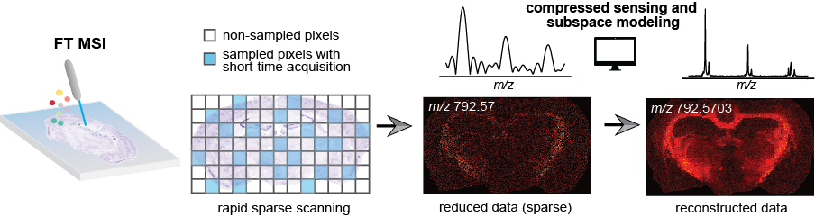

# Joint Compressed Sensing and Subspace Modeling of the FT Mass Spectrometry Imaging Data

   

## What's included
This is the code repository containing the processing and algorithmic implementation as described in our paper Enhancing the Throughput of FT Mass Spectrometry Imaging Using Joint Compressed Sensing and Subspace Modeling (Xie, YR., Castro D.C., Rubakhin, SS., Sweedler J.V., Lam, F.) [[paper]](https://pubs.acs.org/doi/full/10.1021/acs.analchem.1c05279)

The repository contains:
- Preprocessing dependencies to prepare data sets from Bruker FT-ICR acquisitions and flexImaging generated files.
- A python executable binary for the joint CS and subspace reconstruction.
- Post analysis and processing pipeline to obtain hyperspectral data from reconstructed transients.

## How to run

